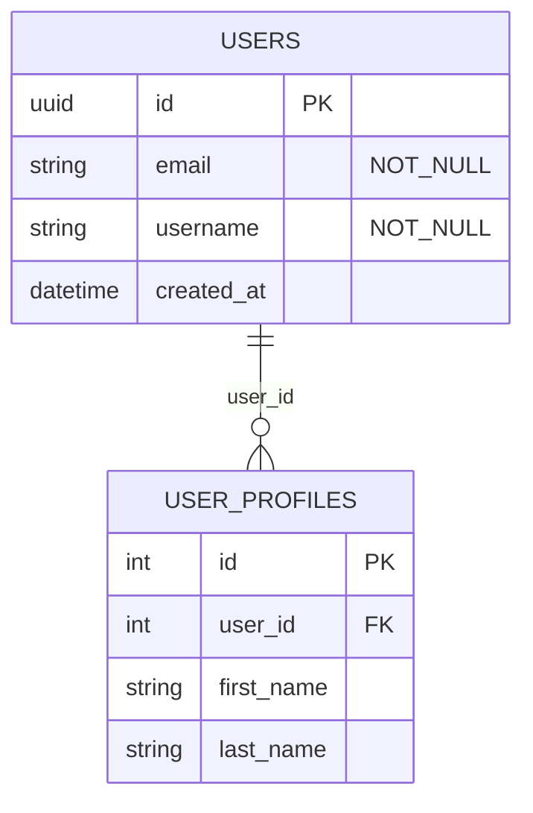
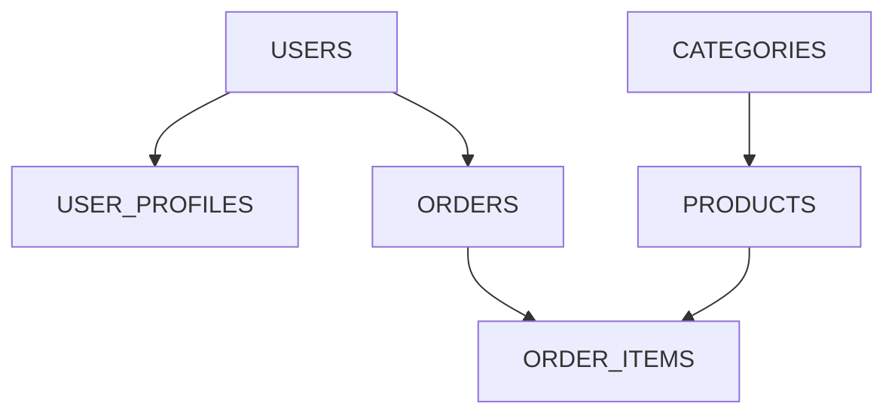

# schema2diagram Command

The `schema2diagram` command generates comprehensive Markdown documentation with interactive Entity Relationship Diagrams (ERD) from YAML schema files. This documentation tool creates professional technical documentation suitable for project documentation, code reviews, and developer onboarding.

## Overview

The `schema2diagram` command scans all YAML schema files in Go module dependencies, merges them into a unified schema, and generates detailed Markdown documentation featuring:

- Interactive Mermaid Entity Relationship Diagrams
- Complete table and field documentation with constraints
- Index and constraint specifications
- Foreign key relationship mapping
- Professional formatting for technical documentation

This tool is ideal for:

- **Project Documentation**: Create comprehensive database documentation for new team members
- **Design Reviews**: Generate visual representations for architecture discussions
- **Technical Specifications**: Produce formal documentation for stakeholders
- **Developer Onboarding**: Provide clear visual guides to database structure
- **API Documentation**: Include database schemas in API documentation
- **Compliance**: Generate documentation for audit and compliance requirements

## Usage

```bash
makemigrations schema2diagram [flags]
```

## Command Flags

| Flag | Type | Default | Description |
|------|------|---------|-------------|
| `--output` | string | `schema-documentation.md` | Output Markdown documentation file path |
| `--verbose` | bool | `false` | Show detailed processing information |

## Global Flags

| Flag | Type | Default | Description |
|------|------|---------|-------------|
| `--config` | string | `migrations/makemigrations.config.yaml` | Path to configuration file |

## Generated Documentation Features

### 1. Entity Relationship Diagram (ERD)

Interactive Mermaid diagram showing:
- All tables with their fields and constraints
- Field types and constraints (PRIMARY KEY, FOREIGN KEY, NOT NULL)
- Relationships between tables with proper notation
- Visual representation of the complete database structure



### 2. Schema Overview

Statistical summary including:
- Total number of tables
- Total number of fields
- Total number of indexes
- Number of foreign key relationships
- Default value mappings

### 3. Complete Table Documentation

For each table:
- **Field Documentation**: Complete specifications including type, constraints, and defaults
- **Index Documentation**: All indexes with their fields and purposes
- **Relationship Documentation**: Foreign key constraints and their behaviors
- **Field Descriptions**: Automatically generated descriptions based on field types

### 4. Index and Constraint Analysis

Comprehensive index documentation:
- All indexes across all tables
- Index types (unique vs regular)
- Performance impact analysis
- Recommendations for index usage

### 5. Relationship Mapping

Detailed relationship documentation:
- All foreign key relationships
- ON DELETE behavior explanations
- Relationship type classifications
- Visual relationship diagrams for complex schemas

## Examples

### Basic Usage

```bash
# Generate documentation to default file
makemigrations schema2diagram

# Output
Scanning module dependencies for YAML schemas...
Found 3 YAML schema files
Processing and merging schemas...
Merged schema: 8 tables
Generating Markdown documentation...
Writing documentation file...
Schema documentation successfully generated: schema-documentation.md

Documented 8 tables with Entity Relationship Diagram

The generated Markdown includes:
  • Interactive Mermaid ERD diagram
  • Complete table and field documentation
  • Index and constraint specifications
  • Relationship mapping between tables

View the documentation in any Markdown viewer with Mermaid support.
```

### Custom Output Location

```bash
# Generate to specific directory
makemigrations schema2diagram --output=docs/database-schema.md

# Generate to project documentation
makemigrations schema2diagram --output=README-database.md

# Generate for API documentation
makemigrations schema2diagram --output=api-docs/database-structure.md
```

### Verbose Processing

```bash
# Show detailed processing information
makemigrations schema2diagram --verbose --output=schema-docs.md

# Output
Generating schema documentation with diagrams
===========================================
Output file: schema-docs.md

1. Scanning Go modules for YAML schema files...
Scanning module dependencies...
Found 3 YAML schema files
  - schema/schema.yaml (5 tables)
  - modules/auth/schema.yaml (2 tables)  
  - modules/products/schema.yaml (3 tables)

2. Parsing and merging YAML schemas...
Processing schema: main application
Processing schema: authentication module
Processing schema: product catalog
Merged schema: 10 tables
Available tables: users, user_profiles, products, categories, etc.

3. Generating Markdown documentation...
Creating Entity Relationship Diagram...
Generating table documentation...
Creating index documentation...
Mapping relationships...

4. Writing documentation file...
Schema documentation successfully generated: schema-docs.md
```

## Generated Documentation Structure

### Header Section

```markdown
# Database Schema Documentation

**Database:** myapp  
**Version:** 1.0.0  
**Generated:** 2024-01-22 14:30:00  
```

### Table of Contents

Automatically generated with links to all sections:
- Entity Relationship Diagram
- Schema Overview  
- Individual table documentation
- Indexes and Constraints
- Relationships

### Entity Relationship Diagram

Interactive Mermaid ERD with:
- Proper field type mapping
- Constraint annotations (PK, FK, NOT_NULL)
- Relationship arrows with proper notation
- Consistent table and field naming

### Table Documentation Example

```markdown
### Users Table

**Table Name:** `users`  
**Field Count:** 6  
**Index Count:** 2  

#### Fields

| Field Name | Type | Constraints | Default | Description |
|------------|------|-------------|---------|-------------|
| `id` | UUID | PRIMARY KEY, NOT NULL | `new_uuid` | Universally unique identifier |
| `email` | VARCHAR(255) | NOT NULL | - | Email field |
| `username` | VARCHAR(100) | NOT NULL | - | Username field |
| `password_hash` | VARCHAR(255) | NOT NULL | - | Password hash field |
| `is_active` | BOOLEAN | NULLABLE | `true` | Boolean true/false value |
| `created_at` | TIMESTAMP | NOT NULL | `now` | Automatically set on creation |

#### Indexes

| Index Name | Fields | Type | Purpose |
|------------|--------|------|---------|
| `idx_users_email` | `email` | Unique Index | Uniqueness constraint + query optimization |
| `idx_users_username` | `username` | Unique Index | Uniqueness constraint + query optimization |
```

## Integration with Documentation Tools

### GitHub/GitLab Integration

The generated Markdown works seamlessly with:
- **GitHub**: Renders Mermaid diagrams directly in README files and documentation
- **GitLab**: Full support for Mermaid ERD diagrams in merge requests and wikis
- **Azure DevOps**: Mermaid support in repositories and wikis

### Documentation Platforms

Compatible with:
- **GitBook**: Full Mermaid diagram support
- **Notion**: Import Markdown with diagram support
- **Confluence**: Mermaid plugin support
- **Docusaurus**: Native Mermaid integration
- **MkDocs**: Mermaid plugin support

### IDE Integration

Works with:
- **VS Code**: Markdown Preview Enhanced with Mermaid support
- **IntelliJ IDEA**: Mermaid plugin for diagram rendering
- **Sublime Text**: Mermaid preview packages
- **Atom**: Mermaid preview packages

## Mermaid Diagram Features

### Field Type Mapping

YAML schema types are intelligently mapped to Mermaid-compatible types:

| YAML Type | Mermaid Type | Description |
|-----------|--------------|-------------|
| `varchar`, `text` | `string` | Text fields |
| `integer`, `bigint`, `serial` | `int` | Numeric fields |
| `decimal`, `float` | `decimal` | Decimal fields |
| `boolean` | `boolean` | Boolean fields |
| `timestamp`, `date`, `time` | `datetime` | Date/time fields |
| `uuid` | `uuid` | UUID fields |
| `jsonb` | `json` | JSON fields |
| `foreign_key` | `int` | Foreign key references |

### Constraint Annotations

Visual constraint indicators:
- `PK` - Primary Key
- `FK` - Foreign Key  
- `NOT_NULL` - Required field
- Combination constraints: `"PK,NOT_NULL"`

### Relationship Notation

Standard ERD relationship notation:
- `||--o{` - One-to-many with CASCADE
- `||--||` - One-to-many with RESTRICT/PROTECT
- `||--o|` - One-to-many with SET_NULL

## Use Cases and Workflows

### 1. Project Onboarding Documentation

```bash
# Generate documentation for new developers
makemigrations schema2diagram --output=docs/DATABASE.md

# Add to project README
echo "## Database Schema" >> README.md
echo "See [Database Documentation](docs/DATABASE.md) for complete schema details." >> README.md
```

### 2. API Documentation Integration

```bash
# Generate schema docs for API documentation
makemigrations schema2diagram --output=api-docs/database-schema.md

# Include in OpenAPI documentation
echo "For database schema details, see [Database Schema](./database-schema.md)" >> api-docs/README.md
```

### 3. Design Review Process

```bash
# Generate current schema documentation
makemigrations schema2diagram --output=design-review-current.md

# After schema changes
makemigrations schema2diagram --output=design-review-proposed.md

# Compare for review
diff design-review-current.md design-review-proposed.md
```

### 4. Compliance Documentation

```bash
# Generate formal documentation with timestamp
makemigrations schema2diagram --verbose --output="compliance/database-schema-$(date +%Y%m%d).md"

# Archive documentation
mkdir -p compliance/archive/
cp compliance/database-schema-*.md compliance/archive/
```

### 5. Multi-Environment Documentation

```bash
# Document different environments
MAKEMIGRATIONS_CONFIG=staging.config.yaml makemigrations schema2diagram --output=docs/staging-schema.md
MAKEMIGRATIONS_CONFIG=prod.config.yaml makemigrations schema2diagram --output=docs/production-schema.md

# Compare environments
diff docs/staging-schema.md docs/production-schema.md
```

## Advanced Features

### Schema Include Processing

The command processes schema includes automatically:

```yaml
# Main schema.yaml
include:
  - module: github.com/company/auth-module
    path: schemas/auth.yaml
  - module: github.com/company/product-module  
    path: schemas/products.yaml

tables:
  - name: main_table
    # ... field definitions
```

Generated documentation shows:
- Merged schema with all included tables
- Source attribution for included schemas
- Unified relationship mapping across modules

### Complex Relationship Handling

For schemas with many relationships:

```markdown
### Relationship Diagram



*This diagram shows the direction of foreign key relationships.*
```

### Performance Optimization Tips

The documentation includes index performance guidance:

```markdown
### Index Recommendations

- **Unique indexes** enforce data integrity and provide fast lookups
- **Composite indexes** (multiple fields) are most effective when query conditions match the field order  
- **Foreign key fields** should have indexes for optimal JOIN performance
- **Frequently queried fields** benefit from dedicated indexes
```

## Configuration Integration

### Schema Search Paths

Respects configuration settings:

```yaml
# migrations/makemigrations.config.yaml
schema:
  search_paths:
    - "modules/*/database"
    - "vendor/*/schema"
  schema_file_name: database.yaml
```

### Output Customization

Environment variables affect output:

```bash
# Customize documentation generation
MAKEMIGRATIONS_OUTPUT_VERBOSE=true makemigrations schema2diagram --verbose
MAKEMIGRATIONS_OUTPUT_COLOR_ENABLED=false makemigrations schema2diagram
```

## Troubleshooting

### Common Issues and Solutions

1. **No schema files found**
   ```bash
   # Check current directory and configuration
   ls -la schema/
   cat migrations/makemigrations.config.yaml | grep -A5 "schema:"
   ```

2. **Mermaid diagrams not rendering**
   - Ensure your Markdown viewer supports Mermaid
   - GitHub/GitLab render Mermaid automatically
   - Use VS Code with Markdown Preview Enhanced extension
   - Check browser/viewer Mermaid plugin status

3. **Large schemas with performance issues**
   ```bash
   # Use verbose mode to monitor processing time
   time makemigrations schema2diagram --verbose
   
   # Consider splitting large schemas into modules
   find . -name "schema.yaml" -exec wc -l {} +
   ```

4. **Missing relationships in diagram**
   ```bash
   # Verify foreign key definitions in YAML
   grep -n "foreign_key:" schema/schema.yaml
   grep -A3 -B1 "type: foreign_key" schema/schema.yaml
   ```

5. **Output formatting issues**
   ```bash
   # Check generated Markdown syntax
   markdownlint schema-documentation.md
   
   # Validate Mermaid syntax
   mermaid-cli -i schema-documentation.md -o test-output.png
   ```

## Performance Considerations

### Large Schema Optimization

For projects with many schema files:

```bash
# Monitor processing time
time makemigrations schema2diagram --verbose

# Profile memory usage
valgrind --tool=massif makemigrations schema2diagram
```

### Output File Size Management

```bash
# Check generated file size
ls -lh schema-documentation.md

# For very large schemas, consider splitting documentation
wc -l schema-documentation.md
```

## Integration Examples

### CI/CD Pipeline Integration

```yaml
# .github/workflows/docs.yml
name: Update Documentation
on:
  push:
    paths: ['schema/**', '**/schema.yaml']

jobs:
  update-docs:
    runs-on: ubuntu-latest
    steps:
      - uses: actions/checkout@v3
      - name: Generate Schema Documentation
        run: |
          ./makemigrations schema2diagram --output=docs/DATABASE.md
          git add docs/DATABASE.md
          git commit -m "Update database schema documentation"
          git push
```

### Makefile Integration

```makefile
# Makefile
.PHONY: docs schema-docs

docs: schema-docs
	@echo "All documentation updated"

schema-docs:
	@echo "Generating schema documentation..."
	@makemigrations schema2diagram --output=docs/database-schema.md
	@echo "Schema documentation generated at docs/database-schema.md"

schema-docs-verbose:
	@makemigrations schema2diagram --verbose --output=docs/database-schema.md

docs-watch:
	@while inotifywait -e modify schema/; do make schema-docs; done
```

### Pre-commit Hook Integration

```bash
#!/bin/bash
# .git/hooks/pre-commit

echo "Checking for schema changes..."
if git diff --cached --name-only | grep -q "schema.*\.yaml"; then
    echo "Schema files changed, updating documentation..."
    makemigrations schema2diagram --output=docs/DATABASE.md
    git add docs/DATABASE.md
    echo "Database documentation updated and staged"
fi
```

## See Also

- [dump_sql Command](./dump_sql.md) - Generate SQL from schemas
- [db2schema Command](./db2schema.md) - Extract schemas from databases  
- [makemigrations Command](./makemigrations.md) - Generate migrations from schemas
- [Schema Format Guide](../schema-format.md) - YAML schema syntax reference
- [Configuration Guide](../configuration.md) - Configuration options