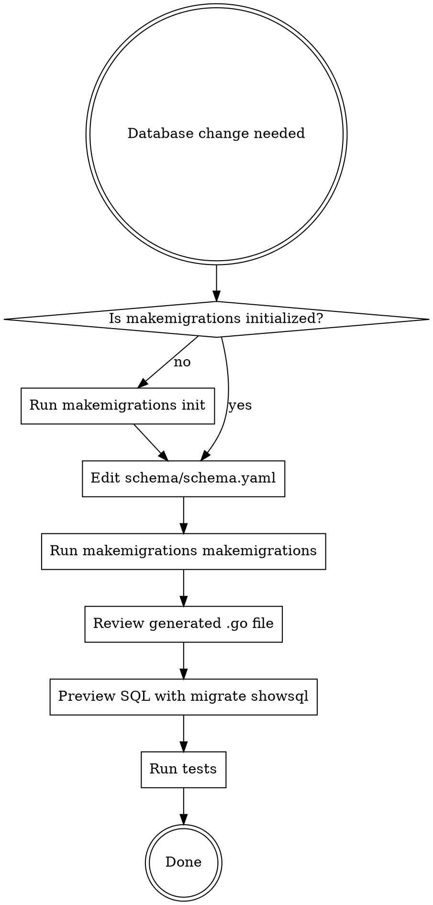

# Go Makemigrations

## Overview

**makemigrations** is the database migration tool for Go projects at Ocom. It works like Django migrations: you define your schema in YAML, and the tool generates type-safe Go migration code.

**Core principle:** schema.yaml is the single source of truth. All database changes flow through it. RunSQL is a last resort.

## When to Use

Auto-trigger on ANY of these:

- "Add a table/model/field/column/index"
- "Change the database schema"
- "Create a migration"
- "Add a foreign key / relationship"
- "Rename a table/column"
- "Remove/drop a table/column"
- Working in a project that has `schema/schema.yaml`
- Working in a project that has `migrations/makemigrations.config.yaml`
- Any request that implies database structure changes

## The Workflow



### Step 1: Check Initialization

Look for `migrations/makemigrations.config.yaml`. If missing:

```bash
makemigrations init --database postgresql
```

This creates:
- `migrations/go.mod`
- `migrations/main.go`
- `migrations/makemigrations.config.yaml`

Then create `schema/schema.yaml` with the initial database definition.

### Step 2: Edit schema/schema.yaml

This is the source of truth. ALL schema changes happen here first.

```yaml
database:
  name: myapp
  version: 1.0.0

defaults:
  postgresql:
    now: CURRENT_TIMESTAMP
    new_uuid: gen_random_uuid()

tables:
  - name: users
    fields:
      - name: id
        type: uuid
        primary_key: true
        default: new_uuid
      - name: email
        type: varchar
        length: 255
        nullable: false
      - name: created_at
        type: timestamp
        default: now
        auto_create: true
    indexes:
      - name: idx_users_email
        fields: [email]
        unique: true
```

### Step 3: Generate Migration

```bash
makemigrations makemigrations --name "describe_the_change"
```

Use `--dry-run` to preview without writing files. Use `--check` to verify schema is up to date (CI use).

### Step 4: Review and Verify

```bash
# Preview the SQL that will run
makemigrations migrate showsql

# Run tests
go test ./...
```

### Step 5: Apply (when ready)

```bash
makemigrations migrate up
```

## Rules

1. **Schema-first**: Edit `schema/schema.yaml` before anything else. Never write SQL to change structure.
2. **Prefer generated code unchanged**: Only modify generated migration `.go` files if you absolutely must (e.g., adding data migration logic). Try to leave them as-is.
3. **RunSQL is last resort**: Only for data migrations or complex SQL that cannot be expressed in the schema. Use `makemigrations empty --name "description"` to create the shell.
4. **Never skip generation**: Don't hand-write migration operations. Let the tool diff the schema and generate them.
5. **Name migrations descriptively**: `--name "add_user_profiles"` not `--name "update"`.

## Quick Reference: Field Types

| Type | Properties | Example |
|------|-----------|---------|
| `varchar` | `length` | `type: varchar, length: 255` |
| `text` | — | `type: text` |
| `text[]` | — | `type: text[]` (PostgreSQL arrays) |
| `integer` | — | `type: integer` |
| `bigint` | — | `type: bigint` |
| `float` | — | `type: float` |
| `decimal` | `precision`, `scale` | `type: decimal, precision: 10, scale: 2` |
| `boolean` | — | `type: boolean` |
| `date` | — | `type: date` |
| `timestamp` | `auto_create`, `auto_update` | `type: timestamp, auto_create: true` |
| `time` | — | `type: time` |
| `uuid` | — | `type: uuid, default: new_uuid` |
| `json` | — | `type: json` |
| `jsonb` | — | `type: jsonb` |
| `serial` | — | `type: serial` (auto-increment) |

## Quick Reference: Field Properties

| Property | Type | Description |
|----------|------|-------------|
| `name` | string | Column name (required) |
| `type` | string | Field type (required) |
| `primary_key` | bool | Mark as primary key |
| `nullable` | bool | Allow NULL (default: true) |
| `default` | string | Default value — references `defaults` section or literal |
| `length` | int | For varchar/text |
| `precision` | int | For decimal |
| `scale` | int | For decimal |
| `auto_create` | bool | Auto-set on INSERT (timestamps) |
| `auto_update` | bool | Auto-set on UPDATE (timestamps) |

## Quick Reference: Foreign Keys

```yaml
- name: author_id
  type: foreign_key
  foreign_key:
    table: users
    on_delete: CASCADE    # CASCADE, RESTRICT, SET_NULL, PROTECT
```

## Quick Reference: Many-to-Many

```yaml
- name: tags
  type: many_to_many
  many_to_many:
    table: tags
```

Generates a junction table automatically.

## Quick Reference: Indexes

```yaml
indexes:
  - name: idx_users_email
    fields: [email]
    unique: true
  - name: idx_posts_search
    fields: [title, body]
    method: GIN           # PostgreSQL: BTREE, HASH, GIN, GIST, BRIN
    where: "deleted_at IS NULL"   # Partial index (PostgreSQL only)
```

## Quick Reference: Defaults Section

Define reusable default values per database type:

```yaml
defaults:
  postgresql:
    now: CURRENT_TIMESTAMP
    new_uuid: gen_random_uuid()
    uuid: uuid_generate_v4()
  mysql:
    now: CURRENT_TIMESTAMP
    new_uuid: UUID()
```

Reference them in fields with `default: now` or `default: new_uuid`.

## Quick Reference: Type Mappings

Override SQL types per database when the built-in mapping doesn't fit:

```yaml
type_mappings:
  postgresql:
    money: "DECIMAL(19,4)"
    percentage: "DECIMAL(5,2)"
  mysql:
    money: "DECIMAL(19,4)"
```

## Quick Reference: Include (Schema Composition)

Import schemas from other Go modules:

```yaml
include:
  - module: github.com/company/auth-schemas
    path: schemas/auth.yaml
```

## Available Commands

| Command | Purpose |
|---------|---------|
| `makemigrations init` | Bootstrap migrations directory |
| `makemigrations makemigrations` | Generate migration from schema diff |
| `makemigrations migrate up` | Apply pending migrations |
| `makemigrations migrate down` | Rollback last migration |
| `makemigrations migrate status` | Show migration status |
| `makemigrations migrate showsql` | Preview SQL without applying |
| `makemigrations migrate dag` | View migration dependency graph |
| `makemigrations empty` | Create blank migration (for RunSQL) |
| `makemigrations db2schema` | Reverse-engineer schema from existing DB |
| `makemigrations struct2schema` | Convert Go structs to schema YAML |
| `makemigrations dump-data` | Generate data-seeding migration |
| `makemigrations dump_sql` | Preview SQL from schema (no migration state) |

## Common Mistakes

| Mistake | Fix |
|---------|-----|
| Writing CREATE TABLE SQL directly | Edit schema.yaml and run `makemigrations makemigrations` |
| Hand-writing migration operations | Let the tool generate them from the schema diff |
| Forgetting `--name` flag | Always name migrations: `--name "add_user_profiles"` |
| Using RunSQL for structure changes | Express it in schema.yaml instead |
| Editing generated migrations unnecessarily | Only modify if you genuinely must; prefer unchanged |
| Not previewing SQL before applying | Always run `migrate showsql` first |

## When RunSQL IS Appropriate

- Data migrations (backfilling values, transforming data)
- Complex constraints the schema format can't express
- Database-specific features not covered by field types (e.g., triggers, stored procedures)
- One-off fixes that don't map to schema changes

Create the shell with: `makemigrations empty --name "description"`
